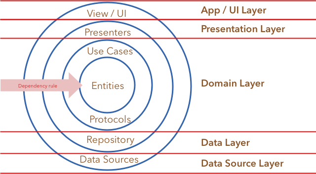

# Recipes - CLEAN Architecture in Android

| Usability | Status |
|--------|--------|
| Build |  |
| Licence |  |
| Usage |  |

[Slides](https://slides.com/drulabs/recipes-clean-android/#/)

This project (a relatively simple one) is an attempt to adapt CLEAN architecture in Android. It showcases usage of Android Architecture Components with RxJava and Dagger2 together to achieve the CLEAN architecture. Please note, this is an adaptation of the original idea presented by Rober C. Martin in his [blog](http://blog.cleancoder.com/uncle-bob/2012/08/13/the-clean-architecture.html) and book ["Clean Architecture: A Craftsman's Guide to Software Structure and Design"](https://www.amazon.com/Clean-Architecture-Craftsmans-Software-Structure/dp/0134494164), the core principles are intact but other rules are modified to showcase working of RxJava, dagger2 and Room with RxJava and LiveData. 

## About the app

This app has 2 screens. First is the Home screen, it allows users to search for a particular recipe term and displays result in a Recycler view. A user can search for a term, favorite a recipe and open the details page (url of the recipe) by clicking on the recipe image. User can also navigate to favourites page using the overflow menu.

Second is the favorites screen, users can navigate here from the overflow menu of home screen. All the favourited recipes are visible here. Favouriting a recipe saves it in the local SQLite database via ROOM, unfavouriting one removes it from local database. ROOM is used only for storing the favourited recipes, the data almost always comes from the remote data source (the [recipe-puppy API](http://www.recipepuppy.com/about/api/)). There is a rudimentry implementation of an in-memory cache in the data layer, feel free to modify it and raise a PR.

## Code structure

All the layers or CLEAN architecture has been separated into individual modules in a single Android studio project. For example there are pure java modules like `domain` and `data`, android library modules like `presentation` and `persistence`. Notice the dependency of these modules. As per the depedency rule of CLEAN architecture, all the dependencies directly or indirectly point towards the the domain layer or module. The domain layer incorporates `entities`, `use-cases` and interfaces required to cross boundaries, `Repository` in this case.

Having separate modules is not necessary, you can create all the laters in the app modules itself. Having separate modules and depending on the intended modules prevent accidental usage of a classes in unintended places.

### CLEAN Architecture in Android:

### Dependency Rule

- Outer circles are mechanisms and solutions (like UI, networking solution, persistence solution etc.)
- The inner circles are rules and policies (the core business logic)
- Dependencies can only point inwards (from concretions towards abstractions)
- Inner circles know nothing about outer circles, hence, outer data formats can’t be used in inner circles
- Dependencies must point towards Stability
- Dependencies must point towards Abstractions

## Libraries

- **RxJava**:for scheduling, mapping, transformation and data transfers. Also used with Room and Retrofit
- **Room**: for locally persisting favourited recipes
- **Retrofit**: Netwoking library
- **ViewModel**: For persisting data across configuration changes
- **Expresso, Mockito, Junit** - For testing
- **Glide** - for Image loading

## Data Source

I have used the [recipe-puppy API](http://www.recipepuppy.com/about/api) to search for recipes and display it in the UI.

## Other details coming soon
